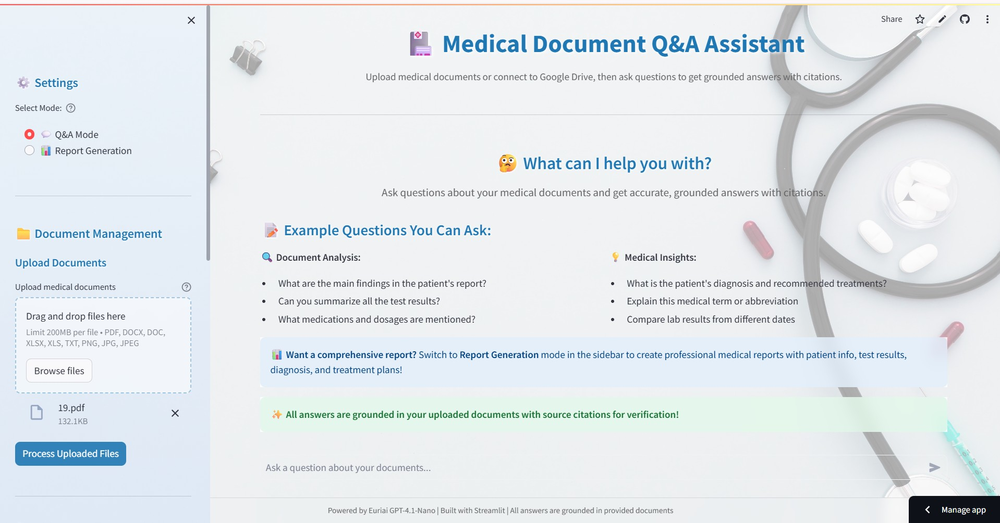

# 🏥 Medical Document Q&A Assistant

[](https://www.python.org/)
[](https://streamlit.io/)
[](LICENSE)
[](https://medical-document-intelligence-assistant.streamlit.app/)

> An intelligent medical document analysis system powered by RAG (Retrieval-Augmented Generation) and LLM technology for extracting insights from medical records and generating comprehensive reports.

## 🌐 Live Demo

**Try it now:** [https://medical-document-intelligence-assistant.streamlit.app/](https://medical-document-intelligence-assistant.streamlit.app/)

## 📸 Screenshots

### Main User Interface


### Q&A Mode with Answers


### Report Generation Interface


## 📋 Overview

The Medical Document Q&A Assistant is a sophisticated application that enables healthcare professionals to:

- **Ask Questions** about medical documents using natural language
- **Generate Reports** with structured medical analysis
- **Extract Information** from various document formats (PDF, DOCX, XLSX, images)
- **Export Reports** to professional PDF format

## ✨ Features

### 🔍 Intelligent Q&A Mode
- Natural language querying of medical documents
- Context-aware responses using RAG pipeline
- Source citation for traceability
- Conversation memory for follow-up questions

### 📊 Automated Report Generation
- **Introduction**: Patient background and context
- **Clinical Findings**: Key medical observations
- **Diagnosis**: Medical conclusions and assessments
- **Treatment Plan**: Recommended interventions
- **Summary**: Comprehensive overview

### 📁 Multi-Format Document Support
- **PDF**: Text and image-based PDFs with OCR
- **Word**: DOCX document processing
- **Excel**: XLSX data extraction
- **Images**: PNG, JPG, JPEG with OCR support

### 💾 Data Management
- Local file upload
- Google Drive integration
- Vector database for efficient retrieval
- FAISS-based semantic search

## 🚀 Quick Start

### Prerequisites
- Python 3.10 (strictly required)
- Tesseract OCR (for image processing)
- Euriai API key

### Installation

1. **Clone the repository**
```bash
git clone https://github.com/pratyushsrivastava500/Medical-Document-QnA-Assistant.git
cd Medical-Document-QnA-Assistant
```

2. **Install dependencies**
```bash
pip install -r requirements.txt
```

3. **Install Tesseract OCR**
   - **Windows**: Download from [GitHub](https://github.com/UB-Mannheim/tesseract/wiki)
   - **macOS**: `brew install tesseract`
   - **Linux**: `sudo apt-get install tesseract-ocr`

4. **Configure environment**
```bash
# Create .env file
EURIAI_API_KEY=your_api_key_here
EURIAI_MODEL=gpt-4.1-nano
EMBEDDING_MODEL=sentence-transformers/all-MiniLM-L6-v2
```

5. **Run the application**
```bash
streamlit run app.py
```

## 🏗️ Architecture

```
         ┌─────────────────┐
         │   Streamlit UI  │
         └────────┬────────┘
                  │
         ┌────────▼─────────────────────┐
         │  Document Processing         │
         │  - PDF/DOCX/XLSX/Images      │
         │  - OCR with Tesseract        │
         └────────┬─────────────────────┘
                  │
         ┌────────▼─────────────────────┐
         │  Embeddings Generation       │
         │  - Sentence Transformers     │
         └────────┬─────────────────────┘
                  │
         ┌────────▼─────────────────────┐
         │  Vector Store (FAISS)        │
         │  - Semantic Search           │
         └────────┬─────────────────────┘
                  │
         ┌────────▼─────────────────────┐
         │  RAG Pipeline                │
         │  - Context Retrieval         │
         │  - LLM Generation            │
         └────────┬─────────────────────┘
                  │
         ┌────────▼─────────────────────┐
         │  Response/Report             │
         │  - PDF Export                │
         └──────────────────────────────┘
```
    └──────────────────────────┘
```

## 🛠️ Technology Stack

| Component | Technology |
|-----------|-----------|
| **Frontend** | Streamlit 1.29.0 |
| **LLM** | Euriai API (gpt-4.1-nano) |
| **Embeddings** | Sentence Transformers (all-MiniLM-L6-v2) |
| **Vector Store** | FAISS (CPU) |
| **Document Processing** | pypdf, python-docx, openpyxl |
| **OCR** | Tesseract + pytesseract |
| **PDF Export** | ReportLab 4.0.7 |

## 📖 Usage Guide

### Q&A Mode

1. **Upload Documents**
   - Click "Upload Medical Documents" in the sidebar
   - Supported formats: PDF, DOCX, XLSX, PNG, JPG, JPEG
   - Or connect Google Drive for cloud access

2. **Process Documents**
   - Click "Process Documents" to build vector database
   - Wait for confirmation message

3. **Ask Questions**
   - Type your question in natural language
   - Example: "What medications is the patient currently taking?"
   - View AI response with source citations

### Report Generation Mode

1. **Select Report Sections**
   - Choose from: Introduction, Clinical Findings, Diagnosis, Treatment Plan, Summary
   - Or select all sections

2. **Generate Report**
   - Click "Generate Report"
   - View generated sections in real-time

3. **Export to PDF**
   - Click "Export Report to PDF"
   - Download professional formatted report

## ⚙️ Configuration

### Environment Variables

Create a `.env` file in the root directory with the following configurations:

```bash
# Euriai API Configuration (Required)
EURIAI_API_KEY=your_api_key_here

# Model Configuration (Required)
EURIAI_MODEL=gpt-4.1-nano
EMBEDDING_MODEL=sentence-transformers/all-MiniLM-L6-v2

# RAG Configuration (Optional - defaults shown)
CHUNK_SIZE=1000
CHUNK_OVERLAP=200
TOP_K_RESULTS=5
```

**Configuration Details:**
- `EURIAI_API_KEY`: Your Euriai API key for LLM access (obtain from [Euriai](https://euriai.com))
- `EURIAI_MODEL`: The LLM model to use (default: gpt-4.1-nano)
- `EMBEDDING_MODEL`: Model for generating document embeddings (default: sentence-transformers/all-MiniLM-L6-v2)
- `CHUNK_SIZE`: Size of text chunks for document processing (default: 1000 characters)
- `CHUNK_OVERLAP`: Overlap between chunks to maintain context (default: 200 characters)
- `TOP_K_RESULTS`: Number of relevant chunks to retrieve for context (default: 5)

### Custom Prompts

Modify prompts in the `prompts/` directory:
- `system_prompt.txt`: Q&A system instructions
- `user_prompt_template.txt`: Q&A user query template
- `report_section_system_prompt.txt`: Report generation system prompt
- `report_section_user_prompt.txt`: Report section template

## 🔧 Troubleshooting

### Common Issues

**Issue**: "Tesseract not found"
- **Solution**: Install Tesseract OCR and add to system PATH

**Issue**: "API key not configured"
- **Solution**: Create `.env` file with valid `EURIAI_API_KEY`

**Issue**: "No documents processed"
- **Solution**: Upload documents and click "Process Documents" before asking questions

**Issue**: "Out of memory"
- **Solution**: Process documents in smaller batches or increase system RAM

## 📁 Project Structure

```
Medical-Document-QnA-Assistant/
├── app.py                      # Main Streamlit application
├── requirements.txt            # Python dependencies
├── .env                        # Environment configuration
├── config/
│   ├── config.py              # Application settings
│   └── __init__.py
├── services/
│   ├── llm_client.py          # LLM API integration
│   ├── rag_pipeline.py        # RAG implementation
│   ├── report_generator.py   # Report generation logic
│   ├── conversation_memory.py # Chat history management
│   ├── google_drive.py        # Google Drive integration
│   └── __init__.py
├── utils/
│   ├── document_processor.py  # Document parsing
│   ├── document_extractor.py  # Text extraction
│   ├── embeddings.py          # Embedding generation
│   ├── vector_store.py        # FAISS vector store
│   ├── pdf_exporter.py        # PDF report export
│   └── __init__.py
├── prompts/
│   ├── system_prompt.txt
│   ├── user_prompt_template.txt
│   ├── report_section_system_prompt.txt
│   └── report_section_user_prompt.txt
└── data/
    ├── uploaded/              # Local file uploads
    ├── gdrive_cache/          # Google Drive cache
    └── vector_db/             # FAISS index storage
```

## 🤝 Contributing

Contributions are welcome! Please feel free to submit a Pull Request.

1. Fork the repository
2. Create your feature branch (`git checkout -b feature/AmazingFeature`)
3. Commit your changes (`git commit -m 'Add some AmazingFeature'`)
4. Push to the branch (`git push origin feature/AmazingFeature`)
5. Open a Pull Request


## 🙏 Acknowledgments

- Euriai for LLM API
- Sentence Transformers for embeddings
- Streamlit for the UI framework
- FAISS for efficient vector search
- Tesseract OCR for image processing

## 📧 Contact

For questions or support, please open an issue on GitHub.

---

**⚠️ Disclaimer**: This tool is for informational purposes only and should not replace professional medical advice, diagnosis, or treatment.

---

<p align="center">
  ⭐ <b>If you find this repository helpful, please consider giving it a star!</b> ⭐
</p>


